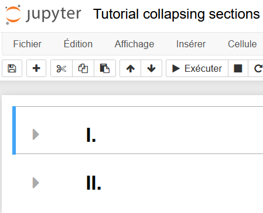

# projet_long_GCN_internet


Le but de ce projet long est de modéliser les échanges au sein d’internet par un graphe, l’appliquer à un réseau convolutif graphique (GCN) afin d’en extraire des caractéristiques.


### Tutorial to have collapsing heading sections





- For a more convenient use, you can activate a plugin :
  `jupyter_nbextensions_configurator`
  Type the following commands

```bash
pip install jupyter_contrib_nbextensions
jupyter contrib nbextension install --user
jupyter nbextensions_configurator enable --user
```


> The other way to have collapsing headings is to **open all the notebook inGoogleCollab**


