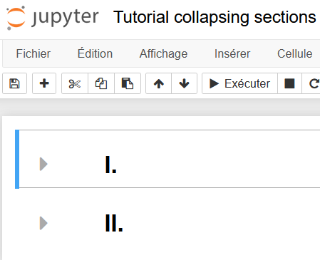

## Tutorial to have collapsing heading sections


<p align="center">
    
</p>

<p align="center">
  <ins>Collapsed headings</ins>
</p>

<br>
<br>

<p align="center">
  
</p>

<p align="center">
  <ins>Expanded headings</ins>
</p>


- You need to activate `jupyter_nbextensions_configurator` **plugin**.

  

**To do it, type the following commands :**

```bash
pip install jupyter_contrib_nbextensions
jupyter contrib nbextension install --user
jupyter nbextensions_configurator enable --user
```

**Then, when restarting the notebook, tick the field *Collapsing Headings***


**Done !**

-----------------


> The other way to **have collapsing headings** is to **open all the notebook in GoogleCollab**


